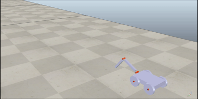

# Neuro Evolution Of Augmenting Topologies applied to crawling robot

This project aims to find a good agent to control a crawling robot using NEAT. [1] 

The agent here is a recurrent neural network whose weights and architecture evolve through generations of evaluation, selection, crossover and mutation.

 

The robot was first trained on the computer using vRep simulation software with a dozen parallel agents training at the same time that would result in a single selected agent at the end. 

 

We then built a robot and controlled it with an arduino using the best agent found after training

The code isn't easily replicable at the moment since it needs a licence for vRep

References:

1. Stanley K, Miikkulainen R. Evolving Neural Networks through Augmenting Topologies. Evol Comput. 2002;10(2):99-127. doi:10.1162/106365602320169811